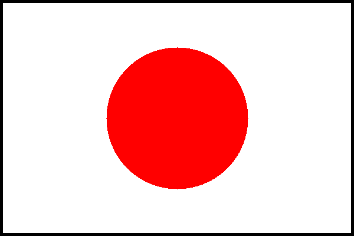
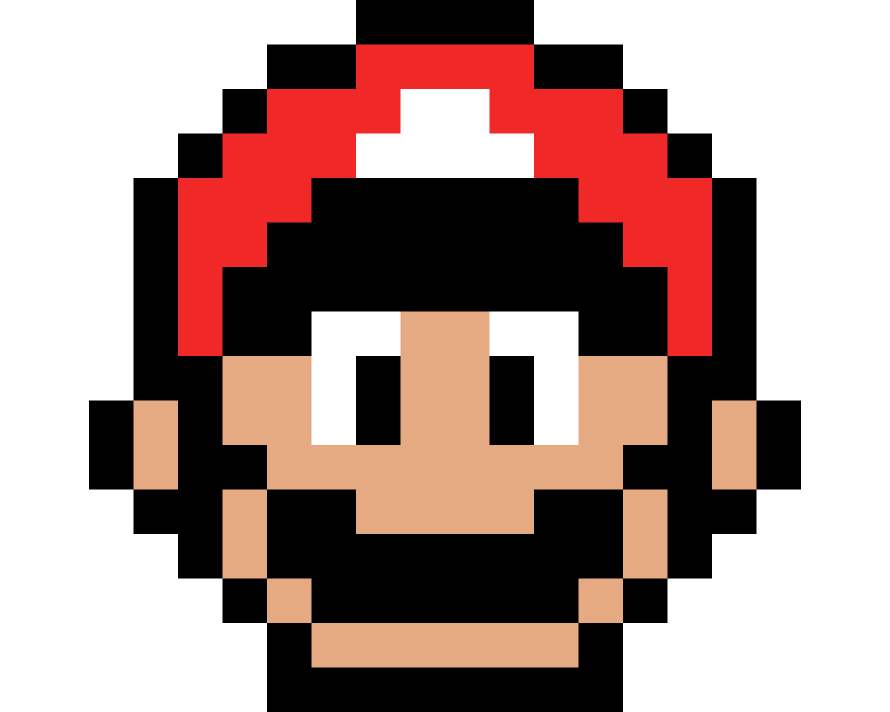
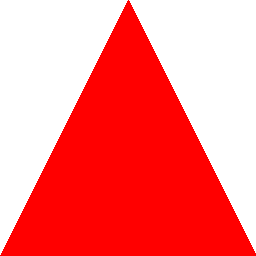

<div id="top"></div>

# Computação Gráfica

<!---Shields em: https://shields.io --->


<!-- LOGO -->
<br />
<div align="center">
  <a href="https://github.com/luccamapt/cg">
    
  </a>

  <h3 align="center">Computação Gráfica - Conjunto de Atividades</h3>

  <h5> Renderização de imagens e aplicação de Ray Tracing. O que será que o Mario tem a ensinar? </h5>
    <br />
    <a href="https://github.com/luccamapt/cg/issues">Reportar erro</a>
    ·
    <a href="https://github.com/luccamapt/cg/issues">Sugerir feature</a>
    ·
    <a href="https://supermario-game.com/pt">Conheça o Mario</a>
</div>
<br />
<br />

## 📜 Sobre o projeto

Bem-vindo ao repositório de exercícios e projetos da disciplina de Computação Gráfica! Aqui você encontrará uma coleção de códigos-fonte, recursos e trabalhos relacionados à exploração e criação de gráficos computacionais, desde algoritmos simples até projetos de renderização 2D e quem sabe 3D 🤨. Aprenda e aprimore junto comigo suas habilidades em processamento de imagens, animação, modelagem 3D e muito mais enquanto mergulha no emocionante mundo da Computação Gráfica. 🎮🎨💻

<p align="right"><a href="#top">↑</a></p>

## ⚙️ Desenvolvido com

Destacando as linguagens e documentações que contribuiram para a elaboração do projeto até aqui:
* [C++](https://devdocs.io/cpp/)
* [Ray Tracing in One Weekend](https://raytracing.github.io/books/RayTracingInOneWeekend.html)

<p align="right"><a href="#top">↑</a></p>

## 🚀 Executando o projeto

### [Atividade 01](https://github.com/luccamapt/cg/tree/main/Atividades/Atividade01)

- Para ter acesso às imagens geradas, é possível compilar os arquivos extensão .cpp com o [g++](https://devdocs.io/gcc~12/), do GNU Compiler Collection no Linux ou WSL (Windows)
- Como o arquivo é gravado no fluxo de saída padrão, é preciso redirecioná-lo para um arquivo de imagem. Normalmente, isso é feito na linha de comando usando o operador de redirecionamento ">". No Linux/WSL ou Mac, podemos fazer o seguinte:
  ```
  build/inOneWeekend > image.ppm
  ```
  Outras instruções podem ser conferidas na documentação do [Ray Tracing in One Weekend](https://raytracing.github.io/books/RayTracingInOneWeekend.html)
- Ao fim, a imagem com extensão .ppm pode ser convertida para outras extensões mais conhecidas ou visualizadas em aplicativos e sites online como o [PPM Viewer](https://www.cs.rhodes.edu/welshc/COMP141_F16/ppmReader.html)

#### Imagens geradas
<table>
  <tr>
    <td align="center">
      <br>
      <sub>
        <b>Japão</b>
      </sub>
    </td>
    <td align="center">
      <br>
      <sub>
        <b>Mario</b>
      </sub>
    </td>
    <td align="center">
      <br>
      <sub>
        <b>Triângulo</b>
      </sub>
    </td>
  </tr>
</table>

### [Atividade 02](https://github.com/luccamapt/cg/tree/main/Atividades/Atividade02)
Nessa atividade foram aprimorada as classes para armazenar vetores geométricos e cores. Em muitos sistemas esses vetores são 4D (posição 3D mais uma coordenada homogênea para geometria, ou RGB mais um componente de transparência alfa para cores).

Inspirado no [Ray Tracing in One Weekend](https://raytracing.github.io/books/RayTracingInOneWeekend.html), usaremos a classe 'Vec3' como base para locais, direções, deslocamentos e o que for necessário (exceto cores).

Dessa forma, foram criada uma nova classe de cor, chamada CorA, que carrega um atriburo Alpha (a) para a transparência/opacidade da cor, similar ao que acontece no padrão RGBA. Além desta, agora podemos definir formas tridimensionais e posicioná-las, com base no 'Vec3'.

### [Atividade 03](https://github.com/luccamapt/cg/tree/main/Atividades/Atividade03)
Para essa atividade iniciamos os trabalhos com o formato OBJ, formato de arquivo de texto que representa objetos tridimensionais, incluindo geometria, material, e informações de textura. Cada arquivo OBJ pode conter uma lista de vértices, normais, texturas, bem como informações sobre os triângulos que compõem o objeto.

Baseado nas especificações da atividade, foi criada uma classe simples para ler modelos OBJ. O ObjLoader possui vetores para armazenar vértices, normais e índices dos triângulos. A função loadObjFile é responsável por ler o arquivo OBJ e preencher esses vetores.

Dessa forma, baseado em repositórios com modelos abertos como o [Free3D](https://free3d.com/) é possível renderizar alguns modelos de teste.


### [Atividade 04](https://github.com/luccamapt/cg/tree/main/Atividades/Atividade04)
Nessa atividade o objetivo foi implementar um sistema simples de renderização baseado em Ray Tracing seguindo os tutoriais disponíveis em [Ray Tracing in One Weekend](https://raytracing.github.io/books/RayTracingInOneWeekend.html) e [Ray Tracing: The Next Week](https://raytracing.github.io/books/RayTracingTheNextWeek.html).

Dessa maneira, foram incluídas as classes Esfera e Triangulo representando objetos tridimensionais, além da utilização das classes Imagem, Cor, Vec3, e Raio para a manipulação de dados necessários.

Foi configurada uma cena simples com uma esfera e um triângulo com o cálculo das interseções entre raios e objetos na cena. para uma renderização atual simplificada.

<p align="right"><a href="#top">↑</a></p>

## 📽️ Projeto Final

O projeto final realizado em grupo pode ser visualizado no [Github do Mateus Vargas](https://github.com/matheusvvb-19/CG_2023-2/tree/main/ProjetoFinal).

A cena construída apresenta um cubo metálico posicionado na origem, entre duas esferas - sendo uma delas de vidro e, a outra, difusa. As esferas se movimentam horizontalmente, enquanto a câmera também se move parcialmente ao redor dos objetos, voltando ao seu ponto inicial. A animação contém 5 segundos e apresenta 10 frames por segundo, totalizando 50 frames, os quais foram unidos através da ferramenta online [Clideo](https://clideo.com/pt/video-maker).

A seguir, estão listados os valores testados, com acesso ao vídeo produzido.

* [image_width 144](https://drive.google.com/file/d/1TD5ir_JYE_QMG4NB8rd6F6YlKBYYVpVu/view?usp=drive_link)
* [image_width 320](https://drive.google.com/file/d/1Cq4PY9jNX12W1-8nP-t8k_wI4yMGPuB8/view?usp=drive_link)
* [image_width 500](https://drive.google.com/file/d/1nLQneh7DMxCckhW7keG_ljAWfTYAhDE3/view?usp=drive_link)
* [image_width 1280](https://drive.google.com/file/d/1CoT6I3p21mKlC8XibMZ8JRoH6PplwK8N/view?usp=drive_link)

Todos os vídeos podem ser encontrados no [Google Drive](https://drive.google.com/drive/folders/18PHfVBaKgD7IGaDz2KPG_7jaJL1Chcd8?usp=sharing).

<p align="right"><a href="#top">↑</a></p>

## ✔️ Roadmap - Ajustes e melhorias

O projeto ainda está em desenvolvimento de acordo com a sequência de atividades. Ainda assim, as próximas atualizações serão voltadas nas seguintes tarefas:

- [ ] Otimização do código de Pixel Art com Classes e métodos.
- [ ] Implementação de um método para definir aspect ratio e proporção das imagens.
- [x] Novas funções para geração de "padrões" de desenhos (retas, círculos).
- [x] Criação de um "espaço 3D" para posicionar objetos.
- [x] Otimização dos testes unitários.

<p align="right"><a href="#top">↑</a></p>

## 🤝 Colaborador

Por enquanto, apenas um padawan traça a jornada do herói:

<table>
  <tr>
    <td align="center">
      <a href="https://github.com/luccamapt">
        <br>
        <sub>
          <b>Lucca Marques</b>
        </sub>
      </a>
    </td>
  </tr>
</table>
